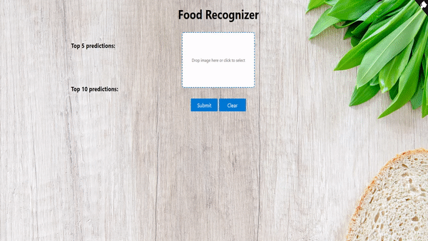

### Food Recognizer Web App

Our Food Recognition model for Food - 101 categories is in folder named 'models'. You can replace the model by your model and update 
categories list in 'app.py' file to your classes/labels.

1. Clone this repo

  --> $ git clone 'Repository name'
  
  --> cd 'Repository name'
  
  --> cd 'Food Recognizer Web App'

2. Install requirements

  --> $ pip install -r requirements.txt

3. Run the script

  --> $ python app.py

4. Go to http://127.0.0.1:5000

  --> Done

Reference:

1. Building a simple Keras + deep learning REST API
2. keras-flask-deploy-webapp on git
