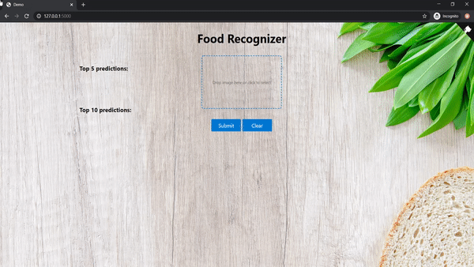

# S20-team8-project
## Team 8 - ALCOVE - Attention to the right details with detailed attention.
### Food Recognition Software for a Web App
---

This project uses convolutional neural network to generate a food recognization model for a free food finder webapp. The model is trained on a very famous dataset Food101 provided by Kaggle and originally from the research paper "Food-101 – Mining Discriminative Components with Random Forests" by Lukas Bossard [1].

Food-101 is a challenging dataset consisting of 101,000 images of 101 different food classes.  On purpose, the training images were not cleaned, and thus still contain some amount of noise. This comes mostly in the form of intense colors and sometimes wrong labels. Taking a look at some of the images, we can see that the dataset is consist of random pictures taken by the mobile phone rather than beautifuly showcased food. For example, all of the images below have been labelled as "bread pudding", yet even as a human, I think I’d struggle to classify them as such.


We process this data using three models called Model 1, Model 2, and Model 3, each taking in 101, 50, and 25 food categories respectively. By applying transfer learning using a pre-trained weights on the NASNet architecture we achieved reasonable accuracy and F1 scores across all of our models.

# Getting Started

Before you can run this project, you will need to install some programs and dependencies.

## Installing necessary programs and libraries

1. Python 3 or higher: Python 3 is necessary to run another program that we use: Jupyter Notebook. Python 3 can be found at https://python.org/downloads/. We would suggest Python 3.7.6 because that is what we used for our project.

2. Jupyter Notebook: The project is written in .ipynb files. To open these files, you'll need Jupyter Notebook. You can install this at https://jupyter.org/install

3. PIP: PIP is a python package manager. It is necessary to easily install the dependencies of this project. You can find out how to install PIP at https://pip.pypa.io/en/stable/installing/   

4. After cloning the repository, you may install the necessary dependencies by navigating to the the top directory (that contains the 'requirements.txt' file) and run: pip install -r requirements.txt. This file contains all the libraries required for our neural network as well as our webapp.

## Download Dataset

You can download our dataset from this link [Download Food101 Dataset](http://data.vision.ee.ethz.ch/cvl/food-101.tar.gz)

## Project tree
* [Demo](./Demo) &nbsp;&nbsp;&nbsp; <sup><sub> (Contain our Demo) </sup></sub>
   * [CNN_Models](./Demo/CNN_Models)  &nbsp;&nbsp;&nbsp; <sup><sub> (This directory contains demo for our neural network) </sup></sub>
      * [Model1-Demo.ipynb](./Demo/CNN_Models/Model1-Demo.ipynb)
      * [Model2-Demo.ipynb](./Demo/CNN_Models/Model2-Demo.ipynb)
      * [Model3-Demo.ipynb](./Demo/CNN_Models/Model3-Demo.ipynb)
   *  [FoodRecognizer-Webapp](./Demo/FoodRecognizer-Webapp)  &nbsp;&nbsp;&nbsp; <sup><sub> (This directory contains demo for our webapp) </sup></sub>
* [Different Neural Network Architecture](./Different%20Neural%20Network%20Architecture) &nbsp;&nbsp;&nbsp; <sup><sub> (Contains all the models we tried with code and figures for visualization) </sup></sub>
   * [Figure generation and accuracy ](https://github.com/CSCI4850/S20-team8-project/tree/master/Different%20Neural%20Network%20Architecture/figure_generation_and_data)
      * [Average 5Fold accuracy and F1 for Model1, Model2 and Model3 ](https://github.com/CSCI4850/S20-team8-project/tree/master/Different%20Neural%20Network%20Architecture/figure_generation_and_data/graphz.ipynb)
* [Project_Paper](./Project_Paper)  &nbsp;&nbsp;&nbsp; <sup><sub> (Contains .tex and .bib file for the final paper) </sup></sub>
* [Project_Presentation.pdf](./Project_Presentation.pdf) 
* [Project_Presentation.pptx](./Project_Presentation.pptx)
* [README.md](./README.md)
* [Project_Proposal.ipynb](./Project_Proposal.ipynb)   
* [Project_Milestone.ipynb](./Project_Milestones.ipynb)
* [Project_Paper.pdf](./Project_Paper.pdf)   &nbsp;&nbsp;&nbsp; <sup><sub> (Final paper in pdf format) </sup></sub>
* [requirement.txt](./requirements.txt)    &nbsp;&nbsp;&nbsp; <sup><sub> (Requirements for the project) </sup></sub>

## Running Project
### Step to run our code to obtain the neural network model
```shell
1. Clone this repo
   $ git clone 'https://github.com/CSCI4850/S20-team8-project.git'
   $ cd S20-team8-project
   $ cd Demo
   $ cd CNN_Models
```
2. Run ipynb notebook file

    --> [Model1-Demo.ipynb ](./Demo/CNN_Models/Model1-Demo.ipynb)

    --> [Model2-Demo.ipynb ](./Demo/CNN_Models/Model2-Demo.ipynb)

    --> [Model3-Demo.ipynb ](./Demo/CNN_Models/Model3-Demo.ipynb)
  
3. Your Model will be saved in the same folder with name 'model-101.h5', model-50.h5 and model-25.h5

4. Done

### Step to run our web app using the model created
Our Food Recognition model for Food - 101 categories is in folder named [model](https://github.com/CSCI4850/S20-team8-project/tree/master/Demo/FoodRecognizer-Webapp/models). You can replace the model by your model and update 
categories list with the name 'CATEGORIES' in 'app.py' file to your classes/labels if needed.

```shell
# 1. First, clone the repo and go to the folder having app.py
  $ git clone 'https://github.com/CSCI4850/S20-team8-project.git'
  $ cd S20-team8-project 
  $ cd 'Demo'
  $ cd 'FoodRecognizer-Webapp'

# 2. Run!the script
  $ python app.py

# 3. Go to http://127.0.0.1:5000

# 4. Done
```
## Demo
After creating the model and deploying it to the webapp. This is how your webapp is going to work with your model.

&nbsp;&nbsp;&nbsp;&nbsp;&nbsp;&nbsp;&nbsp;&nbsp;&nbsp;&nbsp;&nbsp;&nbsp;&nbsp;&nbsp;&nbsp;&nbsp;&nbsp;&nbsp;&nbsp;&nbsp;&nbsp;&nbsp;
&nbsp;&nbsp;&nbsp;&nbsp;&nbsp;&nbsp;&nbsp;&nbsp;&nbsp;&nbsp;&nbsp;&nbsp;

Detailed discription about each model can be found in the folder CNN_Models inside the Demo Folder in the root directory. There are file in there (Model1-Demo.ipynb, Model2-Demo.ipynb, and Model3-Demo.ipynb) that contains a walkthrough of the project. Going through this demo and running the code will give you a better understanding of the project.

## References
<a id="1">[1]</a> 
Lukas Bossard, Matthieu Guillaumin, and Luc Van Gool. Food-101 – mining discrimi-native components with random forests. In European Conference on Computer Vision,2014

<a id="2">[2]</a> 
https://github.com/mtobeiyf/keras-flask-deploy-webapp.git


### Members
Heena Khan, Luis Chunga, Steven Sheffey, James Phillips, Matthew Radice, Elijah Barbour, Mason Thieman.

The code being developed within this repository is for an image recognition algorithm which will be incorporated into a web app. This group project fulfills the requirements for completing CSCI 4850/5850 Spring 2020 Neural Networks class at Middle Tennessee State University.
